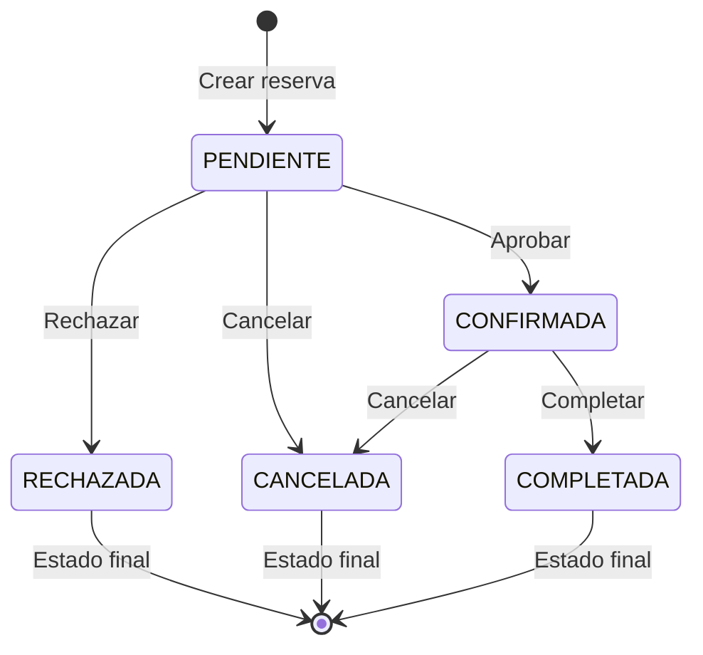

# GUÍA DE USO DE APIs - SISTEMA DE RESERVAS DE AULAS

**Versión**: 1.0
**Fecha**: Noviembre 2025
**Proyecto**: SIGESDA Backend

---

## TABLA DE CONTENIDOS

1. [Información General](#1-información-general)
2. [Estados de Reservas (Catálogo)](#2-estados-de-reservas-catálogo)
3. [Reservas de Aulas - CRUD](#3-reservas-de-aulas---crud)
4. [Workflow de Estados](#4-workflow-de-estados)
5. [Detección de Conflictos](#5-detección-de-conflictos)
6. [Consultas Especiales](#6-consultas-especiales)
7. [Operaciones Masivas](#7-operaciones-masivas)
8. [Validaciones y Reglas de Negocio](#8-validaciones-y-reglas-de-negocio)
9. [Errores Comunes](#9-errores-comunes)
10. [Ejemplos de Uso Completo](#10-ejemplos-de-uso-completo)

---

## 1. INFORMACIÓN GENERAL

### Base URL
```
http://localhost:8000/api
```

### Formato de Datos

#### IDs
- **Tipo**: `number` (enteros con autoincrement)
- ⚠️ **Importante**: Los IDs son números, NO strings ni UUIDs

```json
// ✅ CORRECTO
{ "aulaId": 1 }

// ❌ INCORRECTO
{ "aulaId": "1" }
{ "aulaId": "cuid123..." }
```

#### Fechas
- **Formato**: ISO 8601 completo con timezone
- **Ejemplo**: `"2025-11-26T10:00:00.000Z"`

```json
// ✅ CORRECTO
{
  "fechaInicio": "2025-11-26T10:00:00.000Z",
  "fechaFin": "2025-11-26T12:00:00.000Z"
}

// ❌ INCORRECTO
{
  "fechaInicio": "2025-11-26",
  "fechaFin": "26/11/2025 12:00"
}
```

### Estructura de Respuestas

Todas las respuestas siguen el formato estándar:

```json
{
  "success": true | false,
  "message": "Mensaje descriptivo",
  "data": { /* objeto o array */ },
  "meta": { /* metadata opcional */ }
}
```

### Códigos HTTP

| Código | Significado | Cuándo se usa |
|--------|-------------|---------------|
| `200` | OK | Operación exitosa (GET, PUT, DELETE) |
| `201` | Created | Recurso creado exitosamente (POST) |
| `207` | Multi-Status | Operación masiva con errores parciales |
| `400` | Bad Request | Datos inválidos o validación fallida |
| `404` | Not Found | Recurso no encontrado |
| `500` | Internal Server Error | Error del servidor |

---

## 2. ESTADOS DE RESERVAS (CATÁLOGO)

**Ruta base**: `/api/catalogos/estados-reservas`

### Estados del Sistema

| ID | Código | Nombre | Descripción | ¿Es Final? |
|----|--------|--------|-------------|------------|
| 1 | PENDIENTE | Pendiente | Estado inicial por defecto | No |
| 2 | CONFIRMADA | Confirmada | Reserva aprobada | No |
| 3 | RECHAZADA | Rechazada | Reserva rechazada | Sí |
| 4 | CANCELADA | Cancelada | Reserva cancelada | Sí |
| 5 | COMPLETADA | Completada | Reserva finalizada | Sí |

---

### 2.1 Crear Estado de Reserva

```http
POST /api/catalogos/estados-reservas
Content-Type: application/json
```

**Request Body**:
```json
{
  "codigo": "EN_PROCESO",           // REQUIRED: String, MAYÚSCULAS con _, max 50
  "nombre": "En Proceso",           // REQUIRED: String, max 100
  "descripcion": "Estado temporal", // OPTIONAL: String, max 500
  "activo": true,                   // OPTIONAL: Boolean, default true
  "orden": 10                       // OPTIONAL: Number >= 0, default 0
}
```

**Response** (201 Created):
```json
{
  "success": true,
  "message": "Estado de reserva creado exitosamente",
  "data": {
    "id": 6,
    "codigo": "EN_PROCESO",
    "nombre": "En Proceso",
    "descripcion": "Estado temporal",
    "activo": true,
    "orden": 10,
    "createdAt": "2025-11-25T10:00:00.000Z",
    "updatedAt": "2025-11-25T10:00:00.000Z"
  }
}
```

**Validaciones**:
- `codigo`: Debe estar en MAYÚSCULAS y usar guiones bajos (ej: `PENDIENTE`, `EN_PROCESO`)
- `codigo`: Debe ser único (no puede repetirse)
- `nombre`: Requerido, 1-100 caracteres

---

### 2.2 Listar Estados de Reserva

```http
GET /api/catalogos/estados-reservas?activo=true&orderBy=orden&orderDir=asc&page=1&limit=50
```

**Query Parameters**:

| Parámetro | Tipo | Descripción | Default |
|-----------|------|-------------|---------|
| `activo` | boolean | Filtrar por activos/inactivos | - |
| `search` | string | Buscar en código y nombre (max 100 chars) | - |
| `page` | number | Número de página | 1 |
| `limit` | number | Resultados por página (max 100) | 50 |
| `includeInactive` | boolean | Incluir inactivos | false |
| `orderBy` | enum | Campo de ordenación: `codigo`, `nombre`, `orden`, `created_at` | `orden` |
| `orderDir` | enum | Dirección: `asc` o `desc` | `asc` |

**Response** (200 OK):
```json
{
  "success": true,
  "data": [
    {
      "id": 1,
      "codigo": "PENDIENTE",
      "nombre": "Pendiente",
      "descripcion": "Reserva pendiente de aprobación",
      "activo": true,
      "orden": 0,
      "_count": {
        "reservas": 15
      }
    },
    {
      "id": 2,
      "codigo": "CONFIRMADA",
      "nombre": "Confirmada",
      "descripcion": "Reserva confirmada y aprobada",
      "activo": true,
      "orden": 1,
      "_count": {
        "reservas": 42
      }
    }
  ],
  "message": "Se encontraron 2 estado(s) de reserva"
}
```

---

### 2.3 Obtener Estado por ID

```http
GET /api/catalogos/estados-reservas/:id
```

**Ejemplo**:
```http
GET /api/catalogos/estados-reservas/1
```

**Response** (200 OK):
```json
{
  "success": true,
  "data": {
    "id": 1,
    "codigo": "PENDIENTE",
    "nombre": "Pendiente",
    "descripcion": "Reserva pendiente de aprobación",
    "activo": true,
    "orden": 0,
    "createdAt": "2025-11-01T10:00:00.000Z",
    "updatedAt": "2025-11-25T10:00:00.000Z"
  }
}
```

**Response** (404 Not Found):
```json
{
  "success": false,
  "error": "Estado de reserva con ID 999 no encontrado"
}
```

---

### 2.4 Obtener Estado por Código

```http
GET /api/catalogos/estados-reservas/codigo/:codigo
```

**Ejemplo**:
```http
GET /api/catalogos/estados-reservas/codigo/CONFIRMADA
```

**Response** (200 OK):
```json
{
  "success": true,
  "data": {
    "id": 2,
    "codigo": "CONFIRMADA",
    "nombre": "Confirmada",
    "descripcion": "Reserva confirmada y aprobada",
    "activo": true,
    "orden": 1,
    "createdAt": "2025-11-01T10:00:00.000Z",
    "updatedAt": "2025-11-01T10:00:00.000Z"
  }
}
```

---

### 2.5 Actualizar Estado de Reserva

```http
PUT /api/catalogos/estados-reservas/:id
Content-Type: application/json
```

**Request Body** (todos los campos son opcionales):
```json
{
  "codigo": "CONFIRMADA",
  "nombre": "Confirmada - Aprobada",
  "descripcion": "Reserva confirmada y lista para usar",
  "activo": true,
  "orden": 1
}
```

**Response** (200 OK):
```json
{
  "success": true,
  "message": "Estado de reserva actualizado exitosamente",
  "data": {
    "id": 2,
    "codigo": "CONFIRMADA",
    "nombre": "Confirmada - Aprobada",
    "descripcion": "Reserva confirmada y lista para usar",
    "activo": true,
    "orden": 1,
    "createdAt": "2025-11-01T10:00:00.000Z",
    "updatedAt": "2025-11-25T14:30:00.000Z"
  }
}
```

---

### 2.6 Desactivar Estado (Soft Delete)

```http
DELETE /api/catalogos/estados-reservas/:id
```

**Response** (200 OK):
```json
{
  "success": true,
  "message": "Estado de reserva 'En Proceso' desactivado exitosamente",
  "data": {
    "id": 6,
    "codigo": "EN_PROCESO",
    "nombre": "En Proceso",
    "activo": false,
    "updatedAt": "2025-11-25T15:00:00.000Z"
  }
}
```

⚠️ **Nota**: Realiza **soft delete** (marca `activo = false`), NO elimina físicamente el registro.

---

### 2.7 Reordenar Estados

```http
PATCH /api/catalogos/estados-reservas/reorder
Content-Type: application/json
```

**Request Body**:
```json
{
  "ids": [3, 1, 2, 4, 5]
}
```

**Response** (200 OK):
```json
{
  "success": true,
  "message": "Estados reordenados exitosamente",
  "data": {
    "count": 5
  }
}
```

**Validaciones**:
- Debe proporcionar al menos un ID
- Los IDs deben existir en la base de datos

---

### 2.8 Obtener Estadísticas de Uso

```http
GET /api/catalogos/estados-reservas/estadisticas/uso
```

**Response** (200 OK):
```json
{
  "success": true,
  "data": [
    {
      "id": 1,
      "codigo": "PENDIENTE",
      "nombre": "Pendiente",
      "totalReservas": 15,
      "orden": 0
    },
    {
      "id": 2,
      "codigo": "CONFIRMADA",
      "nombre": "Confirmada",
      "totalReservas": 42,
      "orden": 1
    },
    {
      "id": 4,
      "codigo": "CANCELADA",
      "nombre": "Cancelada",
      "totalReservas": 8,
      "orden": 3
    }
  ],
  "message": "Estadísticas de uso de estados obtenidas exitosamente"
}
```

---

## 3. RESERVAS DE AULAS - CRUD

**Ruta base**: `/api/reservas`

### Estructura de Datos de Reserva

```typescript
interface Reserva {
  id: number;                      // PK autoincrement
  aulaId: number;                  // FK a Aula (REQUIRED)
  actividadId: number | null;      // FK a Actividad (OPTIONAL)
  docenteId: number;               // FK a Persona (REQUIRED, debe ser DOCENTE activo)
  estadoReservaId: number;         // FK a EstadoReserva (auto-asigna PENDIENTE si omite)
  fechaInicio: string;             // DateTime ISO 8601 (REQUIRED)
  fechaFin: string;                // DateTime ISO 8601 (REQUIRED)
  observaciones: string | null;    // Max 500 caracteres (OPTIONAL)
  activa: boolean;                 // Default true, false cuando cancelada/rechazada
  motivoCancelacion: string | null;// Requerido al cancelar/rechazar
  canceladoPorId: number | null;   // FK a Persona que canceló/rechazó
  aprobadoPorId: number | null;    // FK a Persona que aprobó
  createdAt: string;               // DateTime ISO 8601
  updatedAt: string;               // DateTime ISO 8601

  // Relaciones (cuando se incluyen)
  aulas?: { id: number; nombre: string; /* ... */ };
  actividades?: { id: number; nombre: string; /* ... */ };
  personas?: { id: number; nombre: string; apellido: string; /* ... */ };
  estadoReserva?: { id: number; codigo: string; nombre: string };
  aprobadoPor?: { id: number; nombre: string; apellido: string };
  canceladoPor?: { id: number; nombre: string; apellido: string };
}
```

---

### 3.1 Crear Reserva

```http
POST /api/reservas
Content-Type: application/json
```

**Request Body**:
```json
{
  "aulaId": 1,                              // REQUIRED: number
  "docenteId": 5,                           // REQUIRED: number (debe ser DOCENTE activo)
  "actividadId": 3,                         // OPTIONAL: number | null
  "estadoReservaId": 1,                     // OPTIONAL: number (si omite, usa PENDIENTE)
  "fechaInicio": "2025-11-26T10:00:00.000Z", // REQUIRED: ISO 8601
  "fechaFin": "2025-11-26T12:00:00.000Z",    // REQUIRED: ISO 8601
  "observaciones": "Clase de piano avanzado" // OPTIONAL: string, max 500 chars
}
```

**Response** (201 Created):
```json
{
  "success": true,
  "message": "Reserva de aula creada exitosamente",
  "data": {
    "id": 10,
    "aulaId": 1,
    "docenteId": 5,
    "actividadId": 3,
    "estadoReservaId": 1,
    "fechaInicio": "2025-11-26T10:00:00.000Z",
    "fechaFin": "2025-11-26T12:00:00.000Z",
    "observaciones": "Clase de piano avanzado",
    "activa": true,
    "motivoCancelacion": null,
    "canceladoPorId": null,
    "aprobadoPorId": null,
    "createdAt": "2025-11-25T10:00:00.000Z",
    "updatedAt": "2025-11-25T10:00:00.000Z",
    "aulas": {
      "id": 1,
      "nombre": "Aula Principal",
      "capacidad": 30,
      "ubicacion": "Planta Baja",
      "activa": true
    },
    "personas": {
      "id": 5,
      "nombre": "Juan",
      "apellido": "Pérez",
      "dni": "12345678",
      "especialidad": "Piano"
    },
    "actividades": {
      "id": 3,
      "nombre": "Piano Avanzado",
      "descripcion": "Curso de piano nivel avanzado"
    },
    "estadoReserva": {
      "id": 1,
      "codigo": "PENDIENTE",
      "nombre": "Pendiente"
    }
  }
}
```

**Validaciones Automáticas**:

✅ **Fechas**:
- `fechaInicio < fechaFin` (fecha inicio debe ser anterior a fecha fin)
- `fechaInicio >= (now - 1 hour)` (no reservas en el pasado, permite 1h flexibilidad)
- `duración >= 30 minutos` y `duración <= 12 horas`

✅ **Entidades Relacionadas**:
- Aula existe y está activa
- Docente existe, está activo y tiene tipo DOCENTE
- Actividad existe y está activa (si se proporciona)

✅ **Conflictos**:
- No hay conflictos de horarios con otras reservas del mismo aula
- Docente no tiene otras reservas en ese horario

✅ **Estado**:
- Si no se proporciona `estadoReservaId`, se asigna PENDIENTE automáticamente

**Errores Comunes**:

```json
// Error de conflicto
{
  "success": false,
  "error": "Conflicto de horarios detectado con las siguientes reservas: Aula Principal - 26/11/2025, 10:30:00 a 26/11/2025, 11:30:00"
}

// Error de duración
{
  "success": false,
  "error": "La duración de la reserva debe estar entre 30 minutos y 12 horas"
}

// Error de docente inactivo
{
  "success": false,
  "error": "La persona con ID 5 no es un docente activo"
}
```

---

### 3.2 Listar Reservas con Filtros

```http
GET /api/reservas?aulaId=1&soloActivas=true&fechaDesde=2025-11-01T00:00:00Z&page=1&limit=20
```

**Query Parameters**:

| Parámetro | Tipo | Descripción | Default |
|-----------|------|-------------|---------|
| `aulaId` | number | Filtrar por aula | - |
| `actividadId` | number | Filtrar por actividad | - |
| `docenteId` | number | Filtrar por docente | - |
| `estadoReservaId` | number | Filtrar por estado | - |
| `fechaDesde` | ISO 8601 | Fecha inicio del rango | - |
| `fechaHasta` | ISO 8601 | Fecha fin del rango | - |
| `soloActivas` | boolean | Solo reservas activas | true |
| `incluirPasadas` | boolean | Incluir reservas pasadas | false |
| `page` | number | Número de página | 1 |
| `limit` | number | Resultados por página (max 100) | 10 |

**Response** (200 OK):
```json
{
  "success": true,
  "data": [
    {
      "id": 10,
      "aulaId": 1,
      "fechaInicio": "2025-11-26T10:00:00.000Z",
      "fechaFin": "2025-11-26T12:00:00.000Z",
      "activa": true,
      "aulas": { "nombre": "Aula Principal" },
      "personas": { "nombre": "Juan", "apellido": "Pérez" },
      "estadoReserva": { "codigo": "PENDIENTE", "nombre": "Pendiente" }
    }
  ],
  "meta": {
    "page": 1,
    "limit": 20,
    "total": 45,
    "totalPages": 3
  }
}
```

---

### 3.3 Obtener Reserva por ID

```http
GET /api/reservas/:id
```

**Ejemplo**:
```http
GET /api/reservas/10
```

**Response** (200 OK):
```json
{
  "success": true,
  "data": {
    "id": 10,
    "aulaId": 1,
    "docenteId": 5,
    "actividadId": 3,
    "estadoReservaId": 2,
    "fechaInicio": "2025-11-26T10:00:00.000Z",
    "fechaFin": "2025-11-26T12:00:00.000Z",
    "observaciones": "Clase de piano avanzado",
    "activa": true,
    "motivoCancelacion": null,
    "canceladoPorId": null,
    "aprobadoPorId": 7,
    "createdAt": "2025-11-25T10:00:00.000Z",
    "updatedAt": "2025-11-25T11:30:00.000Z",
    "aulas": {
      "id": 1,
      "nombre": "Aula Principal",
      "capacidad": 30,
      "ubicacion": "Planta Baja",
      "equipamiento": "Piano de cola, sillas",
      "activa": true
    },
    "personas": {
      "id": 5,
      "nombre": "Juan",
      "apellido": "Pérez",
      "dni": "12345678",
      "especialidad": "Piano",
      "fechaBaja": null,
      "email": "juan.perez@example.com",
      "telefono": "123456789"
    },
    "actividades": {
      "id": 3,
      "nombre": "Piano Avanzado",
      "descripcion": "Curso de piano nivel avanzado",
      "activa": true
    },
    "estadoReserva": {
      "id": 2,
      "codigo": "CONFIRMADA",
      "nombre": "Confirmada"
    },
    "aprobadoPor": {
      "id": 7,
      "nombre": "María",
      "apellido": "González"
    },
    "canceladoPor": null
  }
}
```

---

### 3.4 Actualizar Reserva

```http
PUT /api/reservas/:id
Content-Type: application/json
```

**Request Body** (todos los campos son opcionales):
```json
{
  "aulaId": 2,
  "docenteId": 6,
  "actividadId": null,
  "estadoReservaId": 2,
  "fechaInicio": "2025-11-26T14:00:00.000Z",
  "fechaFin": "2025-11-26T16:00:00.000Z",
  "observaciones": "Clase reprogramada"
}
```

**Response** (200 OK):
```json
{
  "success": true,
  "message": "Reserva de aula actualizada exitosamente",
  "data": {
    "id": 10,
    "aulaId": 2,
    "docenteId": 6,
    "actividadId": null,
    "estadoReservaId": 2,
    "fechaInicio": "2025-11-26T14:00:00.000Z",
    "fechaFin": "2025-11-26T16:00:00.000Z",
    "observaciones": "Clase reprogramada",
    "updatedAt": "2025-11-25T12:00:00.000Z",
    "aulas": { /* ... */ },
    "personas": { /* ... */ },
    "estadoReserva": { /* ... */ }
  }
}
```

**Validaciones**:
- Mismas validaciones que en `crear`
- Si cambia horario o aula, valida conflictos (excluyendo la propia reserva)
- Valida disponibilidad del docente

---

### 3.5 Eliminar Reserva

```http
DELETE /api/reservas/:id
```

**Response** (200 OK):
```json
{
  "success": true,
  "message": "Reserva de aula eliminada exitosamente",
  "data": {
    "id": 10,
    "aulaId": 2,
    "fechaInicio": "2025-11-26T14:00:00.000Z",
    "fechaFin": "2025-11-26T16:00:00.000Z"
  }
}
```

⚠️ **Validación**: NO se pueden eliminar reservas que ya finalizaron (para mantener auditoría).

```json
// Error al intentar eliminar reserva pasada
{
  "success": false,
  "error": "No se puede eliminar una reserva que ya finalizó"
}
```

---

### 3.6 Reservas por Aula

```http
GET /api/reservas/aula/:aulaId?incluirPasadas=false
```

**Ejemplo**:
```http
GET /api/reservas/aula/1?incluirPasadas=false
```

**Response** (200 OK):
```json
{
  "success": true,
  "data": [
    {
      "id": 10,
      "aulaId": 1,
      "fechaInicio": "2025-11-26T10:00:00.000Z",
      "fechaFin": "2025-11-26T12:00:00.000Z",
      "personas": { "nombre": "Juan", "apellido": "Pérez" },
      "estadoReserva": { "codigo": "CONFIRMADA", "nombre": "Confirmada" }
    },
    {
      "id": 12,
      "aulaId": 1,
      "fechaInicio": "2025-11-27T14:00:00.000Z",
      "fechaFin": "2025-11-27T16:00:00.000Z",
      "personas": { "nombre": "Ana", "apellido": "Martínez" },
      "estadoReserva": { "codigo": "PENDIENTE", "nombre": "Pendiente" }
    }
  ],
  "meta": {
    "aulaId": 1,
    "incluirPasadas": false,
    "total": 12
  }
}
```

---

### 3.7 Reservas por Docente

```http
GET /api/reservas/docente/:docenteId?incluirPasadas=false
```

**Ejemplo**:
```http
GET /api/reservas/docente/5
```

**Response**: Similar a 3.6

---

### 3.8 Reservas por Actividad

```http
GET /api/reservas/actividad/:actividadId?incluirPasadas=false
```

**Ejemplo**:
```http
GET /api/reservas/actividad/3
```

**Response**: Similar a 3.6

---

## 4. WORKFLOW DE ESTADOS

### Diagrama de Transiciones Permitidas



**Resumen de Transiciones**:

| Estado Actual | Puede cambiar a | Endpoint |
|---------------|-----------------|----------|
| PENDIENTE | CONFIRMADA | `POST /:id/aprobar` |
| PENDIENTE | RECHAZADA | `POST /:id/rechazar` |
| PENDIENTE | CANCELADA | `POST /:id/cancelar` |
| CONFIRMADA | COMPLETADA | `POST /:id/completar` |
| CONFIRMADA | CANCELADA | `POST /:id/cancelar` |
| COMPLETADA | - (final) | - |
| CANCELADA | - (final) | - |
| RECHAZADA | - (final) | - |

---

### 4.1 Aprobar Reserva

**Transición**: `PENDIENTE → CONFIRMADA`

```http
POST /api/reservas/:id/aprobar
Content-Type: application/json
```

**Request Body**:
```json
{
  "aprobadoPorId": 7,                  // REQUIRED: number (ID de persona que aprueba)
  "observaciones": "Aprobado por coordinación" // OPTIONAL: string, max 500 chars
}
```

**Response** (200 OK):
```json
{
  "success": true,
  "message": "Reserva aprobada exitosamente",
  "data": {
    "id": 10,
    "estadoReservaId": 2,
    "aprobadoPorId": 7,
    "updatedAt": "2025-11-25T11:30:00.000Z",
    "estadoReserva": {
      "id": 2,
      "codigo": "CONFIRMADA",
      "nombre": "Confirmada"
    },
    "aprobadoPor": {
      "id": 7,
      "nombre": "María",
      "apellido": "González"
    }
  }
}
```

**Validaciones**:
- Reserva existe
- Estado actual es PENDIENTE
- Persona aprobadora existe y está activa
- Transición PENDIENTE → CONFIRMADA es válida

**Errores**:
```json
{
  "success": false,
  "error": "No se puede aprobar una reserva en estado Confirmada. Solo se pueden aprobar reservas en estado PENDIENTE"
}
```

---

### 4.2 Rechazar Reserva

**Transición**: `PENDIENTE → RECHAZADA` (estado final)

```http
POST /api/reservas/:id/rechazar
Content-Type: application/json
```

**Request Body**:
```json
{
  "rechazadoPorId": 8,                           // REQUIRED: number
  "motivo": "El aula no cumple requisitos acústicos necesarios" // REQUIRED: string, 10-500 chars
}
```

**Response** (200 OK):
```json
{
  "success": true,
  "message": "Reserva rechazada exitosamente",
  "data": {
    "id": 10,
    "estadoReservaId": 3,
    "activa": false,
    "canceladoPorId": 8,
    "motivoCancelacion": "El aula no cumple requisitos acústicos necesarios",
    "updatedAt": "2025-11-25T11:45:00.000Z",
    "estadoReserva": {
      "id": 3,
      "codigo": "RECHAZADA",
      "nombre": "Rechazada"
    }
  }
}
```

**Validaciones**:
- Motivo mínimo 10 caracteres, máximo 500
- Estado actual debe ser PENDIENTE
- Persona rechazadora existe y está activa

⚠️ **Nota**: Al rechazar, la reserva queda marcada como `activa = false` y se registra el motivo en `motivoCancelacion`.

---

### 4.3 Cancelar Reserva

**Transición**: `PENDIENTE | CONFIRMADA → CANCELADA` (estado final)

```http
POST /api/reservas/:id/cancelar
Content-Type: application/json
```

**Request Body**:
```json
{
  "canceladoPorId": 9,                          // REQUIRED: number
  "motivoCancelacion": "Docente enfermo - clase reprogramada" // REQUIRED: string, 10-500 chars
}
```

**Response** (200 OK):
```json
{
  "success": true,
  "message": "Reserva cancelada exitosamente",
  "data": {
    "id": 10,
    "estadoReservaId": 4,
    "activa": false,
    "canceladoPorId": 9,
    "motivoCancelacion": "Docente enfermo - clase reprogramada",
    "updatedAt": "2025-11-25T12:00:00.000Z",
    "estadoReserva": {
      "id": 4,
      "codigo": "CANCELADA",
      "nombre": "Cancelada"
    },
    "canceladoPor": {
      "id": 9,
      "nombre": "Pedro",
      "apellido": "López"
    }
  }
}
```

**Validaciones**:
- Estado actual debe ser PENDIENTE o CONFIRMADA
- Motivo mínimo 10 caracteres, máximo 500
- Persona que cancela existe y está activa

⚠️ **Nota**: Las cancelaciones pueden hacerse desde PENDIENTE o CONFIRMADA.

---

### 4.4 Completar Reserva

**Transición**: `CONFIRMADA → COMPLETADA` (estado final)

```http
POST /api/reservas/:id/completar
Content-Type: application/json
```

**Request Body**: No requiere body (enviar JSON vacío `{}`)

**Response** (200 OK):
```json
{
  "success": true,
  "message": "Reserva completada exitosamente",
  "data": {
    "id": 10,
    "estadoReservaId": 5,
    "fechaInicio": "2025-11-25T10:00:00.000Z",
    "fechaFin": "2025-11-25T12:00:00.000Z",
    "activa": true,
    "updatedAt": "2025-11-25T13:00:00.000Z",
    "estadoReserva": {
      "id": 5,
      "codigo": "COMPLETADA",
      "nombre": "Completada"
    }
  }
}
```

**Validaciones**:
- Estado actual debe ser CONFIRMADA
- La reserva ya debe haber finalizado (`fechaFin < now`)

**Errores**:
```json
// Error si aún no finalizó
{
  "success": false,
  "error": "No se puede completar una reserva que aún no ha finalizado"
}

// Error si no está confirmada
{
  "success": false,
  "error": "No se puede completar una reserva en estado Pendiente. Solo se pueden completar reservas en estado CONFIRMADA"
}
```

---

## 5. DETECCIÓN DE CONFLICTOS

### 5.1 Detectar Conflictos (Reservas Puntuales)

```http
POST /api/reservas/conflicts/detect
Content-Type: application/json
```

**Request Body**:
```json
{
  "aulaId": 1,                              // REQUIRED: number
  "fechaInicio": "2025-11-26T10:00:00.000Z", // REQUIRED: ISO 8601
  "fechaFin": "2025-11-26T12:00:00.000Z",    // REQUIRED: ISO 8601
  "excludeReservaId": 10                    // OPTIONAL: number (para updates)
}
```

**Response** (200 OK):
```json
{
  "success": true,
  "data": {
    "hasConflicts": true,
    "conflicts": [
      {
        "id": 8,
        "aulaId": 1,
        "fechaInicio": "2025-11-26T10:30:00.000Z",
        "fechaFin": "2025-11-26T11:30:00.000Z",
        "observaciones": "Clase de violín",
        "aulas": {
          "id": 1,
          "nombre": "Aula Principal"
        },
        "actividades": {
          "id": 2,
          "nombre": "Violín Intermedio"
        },
        "personas": {
          "id": 6,
          "nombre": "Juan",
          "apellido": "Pérez"
        }
      }
    ],
    "conflictCount": 1
  },
  "meta": {
    "aulaId": 1,
    "period": "2025-11-26T10:00:00.000Z - 2025-11-26T12:00:00.000Z"
  }
}
```

**Lógica de Detección**:
- Detecta solapamiento de horarios: `(inicio < existente.fin) AND (fin > existente.inicio)`
- Excluye reservas inactivas (`activa = false`)
- Opcionalmente excluye una reserva específica (útil para updates)

---

### 5.2 Detectar TODOS los Conflictos (Puntuales + Recurrentes)

```http
POST /api/reservas/conflicts/detect-all
Content-Type: application/json
```

**Request Body**: Igual que 5.1

**Response** (200 OK):
```json
{
  "success": true,
  "data": {
    "hasConflicts": true,
    "puntuales": [
      {
        "id": 8,
        "aulaId": 1,
        "fechaInicio": "2025-11-26T10:30:00.000Z",
        "fechaFin": "2025-11-26T11:30:00.000Z",
        "aulas": { "nombre": "Aula Principal" },
        "personas": { "nombre": "Juan", "apellido": "Pérez" }
      }
    ],
    "recurrentes": [
      {
        "tipo": "RECURRENTE",
        "seccionId": 5,
        "aulaId": 1,
        "diaSemana": "MARTES",
        "horaInicio": "10:00",
        "horaFin": "12:00",
        "seccion": {
          "id": 5,
          "nombre": "Sección Piano A",
          "actividades": {
            "id": 3,
            "nombre": "Piano Avanzado"
          }
        },
        "aula": {
          "id": 1,
          "nombre": "Aula Principal"
        }
      }
    ],
    "totalConflicts": 2
  },
  "meta": {
    "aulaId": 1,
    "period": "2025-11-26T10:00:00.000Z - 2025-11-26T12:00:00.000Z",
    "puntualCount": 1,
    "recurrentCount": 1
  }
}
```

⚠️ **Nota**: Este endpoint combina conflictos de:
- Tabla `reserva_aulas` (reservas puntuales)
- Tabla `reservas_aulas_secciones` (reservas recurrentes de secciones)

---

### 5.3 Verificar Disponibilidad

```http
GET /api/reservas/availability/check?aulaId=1&fechaInicio=2025-11-26T10:00:00Z&fechaFin=2025-11-26T12:00:00Z
```

**Query Parameters**:

| Parámetro | Tipo | Descripción | Required |
|-----------|------|-------------|----------|
| `aulaId` | number | ID del aula | Sí |
| `fechaInicio` | ISO 8601 | Fecha y hora de inicio | Sí |
| `fechaFin` | ISO 8601 | Fecha y hora de fin | Sí |

**Response** (200 OK - Disponible):
```json
{
  "success": true,
  "data": {
    "available": true,
    "conflicts": []
  },
  "meta": {
    "aulaId": "1",
    "period": "2025-11-26T10:00:00Z - 2025-11-26T12:00:00Z",
    "conflictCount": 0
  }
}
```

**Response** (200 OK - NO Disponible):
```json
{
  "success": true,
  "data": {
    "available": false,
    "conflicts": [
      {
        "id": 8,
        "fechaInicio": "2025-11-26T10:30:00.000Z",
        "fechaFin": "2025-11-26T11:30:00.000Z",
        "aulas": { "nombre": "Aula Principal" },
        "personas": { "nombre": "Juan", "apellido": "Pérez" }
      }
    ]
  },
  "meta": {
    "aulaId": "1",
    "period": "2025-11-26T10:00:00Z - 2025-11-26T12:00:00Z",
    "conflictCount": 1
  }
}
```

---

## 6. CONSULTAS ESPECIALES

### 6.1 Próximas Reservas

```http
GET /api/reservas/upcoming/proximas?limit=10
```

**Query Parameters**:

| Parámetro | Tipo | Descripción | Default |
|-----------|------|-------------|---------|
| `limit` | number | Cantidad de resultados | 10 |

**Response** (200 OK):
```json
{
  "success": true,
  "data": [
    {
      "id": 15,
      "aulaId": 1,
      "fechaInicio": "2025-11-26T10:00:00.000Z",
      "fechaFin": "2025-11-26T12:00:00.000Z",
      "aulas": { "nombre": "Aula Principal" },
      "personas": { "nombre": "Juan", "apellido": "Pérez" },
      "actividades": { "nombre": "Piano Avanzado" },
      "estadoReserva": { "codigo": "CONFIRMADA", "nombre": "Confirmada" }
    },
    {
      "id": 16,
      "aulaId": 2,
      "fechaInicio": "2025-11-26T14:00:00.000Z",
      "fechaFin": "2025-11-26T16:00:00.000Z",
      "aulas": { "nombre": "Aula Secundaria" },
      "personas": { "nombre": "Ana", "apellido": "Martínez" },
      "actividades": { "nombre": "Guitarra Inicial" },
      "estadoReserva": { "codigo": "PENDIENTE", "nombre": "Pendiente" }
    }
  ],
  "meta": {
    "limit": 10,
    "total": 10
  }
}
```

⚠️ **Nota**: Ordenadas por `fechaInicio ASC` (de más cercana a más lejana).

---

### 6.2 Reservas Actuales (En Curso)

```http
GET /api/reservas/current/actuales
```

**Response** (200 OK):
```json
{
  "success": true,
  "data": [
    {
      "id": 12,
      "aulaId": 1,
      "fechaInicio": "2025-11-25T10:00:00.000Z",
      "fechaFin": "2025-11-25T12:00:00.000Z",
      "aulas": { "nombre": "Aula Principal" },
      "personas": { "nombre": "Juan", "apellido": "Pérez" },
      "actividades": { "nombre": "Piano Avanzado" },
      "estadoReserva": { "codigo": "CONFIRMADA", "nombre": "Confirmada" }
    }
  ],
  "meta": {
    "timestamp": "2025-11-25T10:30:00.000Z",
    "total": 1
  }
}
```

⚠️ **Nota**: Filtra reservas donde `now >= fechaInicio AND now <= fechaFin`.

---

### 6.3 Búsqueda Avanzada

```http
GET /api/reservas/search/avanzada?search=piano&searchBy=actividad&fechaDesde=2025-11-01T00:00:00Z
```

**Query Parameters**:

| Parámetro | Tipo | Descripción | Required |
|-----------|------|-------------|----------|
| `search` | string | Término de búsqueda (min 1 char) | Sí |
| `searchBy` | enum | Campo de búsqueda: `aula`, `docente`, `actividad`, `observaciones`, `all` | No (default: `all`) |
| `fechaDesde` | ISO 8601 | Fecha inicio del rango | No |
| `fechaHasta` | ISO 8601 | Fecha fin del rango | No |
| `incluirPasadas` | boolean | Incluir reservas pasadas | No (default: `false`) |

**Response** (200 OK):
```json
{
  "success": true,
  "data": [
    {
      "id": 10,
      "aulaId": 1,
      "fechaInicio": "2025-11-26T10:00:00.000Z",
      "fechaFin": "2025-11-26T12:00:00.000Z",
      "aulas": { "nombre": "Aula Principal" },
      "actividades": { "nombre": "Piano Avanzado" },
      "personas": { "nombre": "Juan", "apellido": "Pérez" },
      "estadoReserva": { "codigo": "CONFIRMADA", "nombre": "Confirmada" }
    }
  ],
  "meta": {
    "searchTerm": "piano",
    "searchBy": "actividad",
    "total": 8
  }
}
```

---

### 6.4 Estadísticas

```http
GET /api/reservas/stats/reservas?fechaDesde=2025-11-01T00:00:00Z&fechaHasta=2025-11-30T23:59:59Z&agruparPor=aula
```

**Query Parameters**:

| Parámetro | Tipo | Descripción | Required |
|-----------|------|-------------|----------|
| `fechaDesde` | ISO 8601 | Fecha inicio del período | Sí |
| `fechaHasta` | ISO 8601 | Fecha fin del período | Sí |
| `agruparPor` | enum | Agrupar por: `aula`, `docente`, `actividad`, `dia`, `mes` | No (default: `aula`) |

**Response** (200 OK - agrupado por aula):
```json
{
  "success": true,
  "data": [
    {
      "aulaId": 1,
      "_count": {
        "id": 45
      }
    },
    {
      "aulaId": 2,
      "_count": {
        "id": 32
      }
    }
  ],
  "meta": {
    "period": "2025-11-01T00:00:00Z - 2025-11-30T23:59:59Z",
    "groupBy": "aula"
  }
}
```

---

### 6.5 Dashboard (Vista Combinada)

```http
GET /api/reservas/dashboard/resumen
```

**Response** (200 OK):
```json
{
  "success": true,
  "data": {
    "upcoming": [
      {
        "id": 15,
        "fechaInicio": "2025-11-26T10:00:00.000Z",
        "aulas": { "nombre": "Aula Principal" },
        "personas": { "nombre": "Juan", "apellido": "Pérez" },
        "estadoReserva": { "codigo": "CONFIRMADA" }
      }
    ],
    "current": [
      {
        "id": 12,
        "fechaInicio": "2025-11-25T10:00:00.000Z",
        "fechaFin": "2025-11-25T12:00:00.000Z",
        "aulas": { "nombre": "Aula Secundaria" },
        "personas": { "nombre": "Ana", "apellido": "Martínez" }
      }
    ],
    "weeklyStats": {
      "totalReservas": 28,
      "porEstado": {
        "PENDIENTE": 5,
        "CONFIRMADA": 18,
        "COMPLETADA": 3,
        "CANCELADA": 2
      }
    }
  },
  "meta": {
    "upcomingCount": 5,
    "currentCount": 2,
    "timestamp": "2025-11-25T10:00:00.000Z"
  }
}
```

---

## 7. OPERACIONES MASIVAS

### 7.1 Crear Reservas Masivas

```http
POST /api/reservas/bulk/create
Content-Type: application/json
```

**Request Body**:
```json
{
  "reservas": [
    {
      "aulaId": 1,
      "docenteId": 5,
      "actividadId": 3,
      "fechaInicio": "2025-11-26T10:00:00.000Z",
      "fechaFin": "2025-11-26T12:00:00.000Z",
      "observaciones": "Clase grupo A"
    },
    {
      "aulaId": 2,
      "docenteId": 6,
      "actividadId": 4,
      "fechaInicio": "2025-11-26T14:00:00.000Z",
      "fechaFin": "2025-11-26T16:00:00.000Z",
      "observaciones": "Clase grupo B"
    },
    {
      "aulaId": 1,
      "docenteId": 5,
      "actividadId": 3,
      "fechaInicio": "2025-11-27T10:00:00.000Z",
      "fechaFin": "2025-11-27T12:00:00.000Z"
    }
  ]
}
```

**Response** (201 Created - Éxito total):
```json
{
  "success": true,
  "message": "Creación masiva completada: 3 reservas creadas",
  "data": {
    "created": 3,
    "errors": []
  },
  "meta": {
    "totalAttempted": 3,
    "successful": 3,
    "failed": 0
  }
}
```

**Response** (207 Multi-Status - Éxito parcial):
```json
{
  "success": true,
  "message": "Creación masiva completada: 2 reservas creadas",
  "data": {
    "created": 2,
    "errors": [
      "Conflicto de horarios para Aula 1 en 26/11/2025 10:00:00 - ya existe reserva en ese horario"
    ]
  },
  "meta": {
    "totalAttempted": 3,
    "successful": 2,
    "failed": 1
  }
}
```

⚠️ **Nota**: Cada reserva se valida individualmente. Si alguna falla, las demás se crean igualmente.

---

### 7.2 Eliminar Reservas Masivas

```http
DELETE /api/reservas/bulk/delete
Content-Type: application/json
```

**Request Body**:
```json
{
  "ids": [10, 11, 12, 15]
}
```

**Response** (200 OK):
```json
{
  "success": true,
  "message": "4 reservas eliminadas exitosamente",
  "data": {
    "count": 4
  }
}
```

⚠️ **Validaciones**:
- NO elimina reservas que ya finalizaron
- Si alguna es inválida, falla toda la operación (transacción)

---

### 7.3 Crear Reservas Recurrentes

```http
POST /api/reservas/recurring/create
Content-Type: application/json
```

**Request Body**:
```json
{
  "aulaId": 1,
  "docenteId": 5,
  "actividadId": 3,
  "fechaInicio": "2025-11-26T10:00:00.000Z",
  "fechaFin": "2025-11-26T12:00:00.000Z",
  "observaciones": "Clase semanal de piano",
  "recurrencia": {
    "tipo": "SEMANAL",                        // REQUIRED: 'DIARIO' | 'SEMANAL' | 'MENSUAL'
    "intervalo": 1,                           // REQUIRED: Cada N días/semanas/meses (max 12)
    "diasSemana": [1, 3, 5],                  // OPTIONAL: 0=Domingo, 6=Sábado (solo para SEMANAL)
    "fechaHasta": "2025-12-31T23:59:59.000Z", // REQUIRED: Fecha límite
    "maxOcurrencias": 20                      // OPTIONAL: Máximo de repeticiones (max 100)
  }
}
```

**Response** (201 Created):
```json
{
  "success": true,
  "message": "Reservas recurrentes creadas: 12 reservas generadas exitosamente",
  "data": {
    "created": 12,
    "errors": []
  },
  "meta": {
    "recurrenceType": "SEMANAL",
    "interval": 1,
    "diasSemana": [1, 3, 5],
    "successful": 12,
    "failed": 0,
    "period": "2025-11-26 - 2025-12-31"
  }
}
```

**Response** (207 Multi-Status - Con conflictos):
```json
{
  "success": true,
  "message": "Reservas recurrentes creadas: 10 reservas, 2 omitidas por conflictos",
  "data": {
    "created": 10,
    "errors": [
      "Conflicto en 2025-12-03 10:00 - Aula ocupada",
      "Conflicto en 2025-12-17 10:00 - Aula ocupada"
    ]
  },
  "meta": {
    "recurrenceType": "SEMANAL",
    "interval": 1,
    "successful": 10,
    "failed": 2
  }
}
```

**Lógica de Recurrencia**:

- **DIARIO**: Crea reserva cada N días
  ```json
  { "tipo": "DIARIO", "intervalo": 2, "fechaHasta": "..." }
  // Crea reserva cada 2 días
  ```

- **SEMANAL**: Crea reserva cada N semanas, opcionalmente filtrando por días de semana
  ```json
  { "tipo": "SEMANAL", "intervalo": 1, "diasSemana": [1, 3, 5], "fechaHasta": "..." }
  // Crea reserva cada lunes (1), miércoles (3) y viernes (5)
  ```

- **MENSUAL**: Crea reserva cada N meses
  ```json
  { "tipo": "MENSUAL", "intervalo": 1, "fechaHasta": "..." }
  // Crea reserva el mismo día cada mes
  ```

**Validaciones**:
- `intervalo`: 1-12
- `maxOcurrencias`: max 100
- `diasSemana`: valores 0-6 (solo para SEMANAL)
- `fechaHasta >= fechaFin`
- Cada reserva generada valida conflictos individualmente

---

## 8. VALIDACIONES Y REGLAS DE NEGOCIO

### 8.1 Validaciones de Fecha y Hora

| Validación | Regla | Ejemplo Error |
|------------|-------|---------------|
| Duración mínima | 30 minutos | "La duración debe ser >= 30 minutos" |
| Duración máxima | 12 horas | "La duración debe ser <= 12 horas" |
| Fecha en el pasado | No permitido (acepta hasta 1h atrás) | "No se pueden crear reservas en el pasado" |
| Orden de fechas | `fechaInicio < fechaFin` | "La fecha de inicio debe ser anterior a la fecha de fin" |
| Horario operativo | 08:00 - 22:00 (recomendado) | - |

### 8.2 Validaciones de Entidades Relacionadas

| Entidad | Validaciones |
|---------|--------------|
| **Aula** | • Debe existir<br>• Debe estar activa (`activa = true`) |
| **Docente** | • Debe existir<br>• Debe estar activo (`activo = true`)<br>• Debe tener tipo DOCENTE activo |
| **Actividad** | • Si se proporciona, debe existir<br>• Debe estar activa (`activa = true`) |
| **Estado** | • Si se proporciona, debe existir<br>• Debe estar activo (`activo = true`) |

### 8.3 Validaciones de Conflictos

✅ **Aula**:
- No puede haber solapamiento de horarios en el mismo aula
- Se excluyen reservas inactivas (`activa = false`)
- Al actualizar, se excluye la propia reserva

✅ **Docente**:
- No puede tener reservas simultáneas (mismo horario)
- Se valida disponibilidad automáticamente

### 8.4 Transiciones de Estado

Solo estas transiciones son válidas:

```
PENDIENTE      → CONFIRMADA | RECHAZADA | CANCELADA
CONFIRMADA     → COMPLETADA | CANCELADA
COMPLETADA     → (ninguna, estado final)
CANCELADA      → (ninguna, estado final)
RECHAZADA      → (ninguna, estado final)
```

### 8.5 Reglas de Eliminación

| Condición | ¿Se puede eliminar? |
|-----------|---------------------|
| Reserva futura | ✅ Sí |
| Reserva en curso | ✅ Sí |
| Reserva pasada | ❌ No (auditoría) |

---

## 9. ERRORES COMUNES

### 9.1 Errores de Validación de Fechas

#### Error: "La fecha de inicio debe ser anterior a la fecha de fin"
**Causa**: `fechaInicio >= fechaFin`

**Solución**:
```json
// ❌ INCORRECTO
{
  "fechaInicio": "2025-11-26T12:00:00Z",
  "fechaFin": "2025-11-26T10:00:00Z"
}

// ✅ CORRECTO
{
  "fechaInicio": "2025-11-26T10:00:00Z",
  "fechaFin": "2025-11-26T12:00:00Z"
}
```

---

#### Error: "La duración de la reserva debe estar entre 30 minutos y 12 horas"
**Causa**: Duración fuera de rango

**Solución**:
```json
// ❌ INCORRECTO (20 minutos)
{
  "fechaInicio": "2025-11-26T10:00:00Z",
  "fechaFin": "2025-11-26T10:20:00Z"
}

// ✅ CORRECTO (2 horas)
{
  "fechaInicio": "2025-11-26T10:00:00Z",
  "fechaFin": "2025-11-26T12:00:00Z"
}
```

---

#### Error: "No se pueden crear reservas en el pasado"
**Causa**: `fechaInicio` es anterior a `now - 1 hour`

**Solución**: Usar fechas futuras

---

### 9.2 Errores de Entidades Relacionadas

#### Error: "El aula con ID X no está activa"
**Causa**: Aula desactivada

**Solución**: Activar el aula o elegir otra aula activa

---

#### Error: "La persona con ID X no es un docente activo"
**Causa**: Persona no tiene tipo DOCENTE activo

**Solución**: Asignar tipo DOCENTE a la persona antes de crear la reserva

---

### 9.3 Errores de Conflictos

#### Error: "Conflicto de horarios detectado con las siguientes reservas: Aula Principal - 26/11/2025 10:30:00"
**Causa**: Otra reserva solapa el mismo horario en el aula

**Solución**:
1. Cambiar horario de la reserva
2. Elegir otra aula
3. Verificar disponibilidad primero con `/availability/check`

---

#### Error: "El docente ya tiene reservas en horarios conflictivos: 26/11/2025 10:00-12:00 en Aula Secundaria"
**Causa**: Docente tiene otra reserva simultánea

**Solución**:
1. Cambiar horario
2. Asignar otro docente

---

### 9.4 Errores de Workflow

#### Error: "No se puede aprobar una reserva en estado Confirmada"
**Causa**: Transición de estado inválida

**Solución**: Verificar estado actual y workflow permitido

```
PENDIENTE → aprobar → CONFIRMADA ✅
CONFIRMADA → aprobar → ERROR ❌
```

---

#### Error: "No se puede completar una reserva que aún no ha finalizado"
**Causa**: Intentar completar reserva antes de `fechaFin`

**Solución**: Esperar a que finalice la reserva

---

### 9.5 Errores de Eliminación

#### Error: "No se puede eliminar una reserva que ya finalizó"
**Causa**: Intentar eliminar reserva pasada (auditoría)

**Solución**: No se pueden eliminar reservas finalizadas para mantener historial. Usar cancelación si es necesario.

---

## 10. EJEMPLOS DE USO COMPLETO

### 10.1 Flujo Completo: Crear y Aprobar Reserva

**Paso 1: Verificar disponibilidad**
```http
GET /api/reservas/availability/check?aulaId=1&fechaInicio=2025-11-26T10:00:00Z&fechaFin=2025-11-26T12:00:00Z
```

**Response**:
```json
{
  "success": true,
  "data": {
    "available": true,
    "conflicts": []
  }
}
```

---

**Paso 2: Crear reserva**
```http
POST /api/reservas
Content-Type: application/json

{
  "aulaId": 1,
  "docenteId": 5,
  "actividadId": 3,
  "fechaInicio": "2025-11-26T10:00:00.000Z",
  "fechaFin": "2025-11-26T12:00:00.000Z",
  "observaciones": "Clase de piano nivel avanzado"
}
```

**Response**:
```json
{
  "success": true,
  "message": "Reserva de aula creada exitosamente",
  "data": {
    "id": 10,
    "estadoReservaId": 1,
    "estadoReserva": {
      "codigo": "PENDIENTE"
    }
  }
}
```

---

**Paso 3: Aprobar reserva**
```http
POST /api/reservas/10/aprobar
Content-Type: application/json

{
  "aprobadoPorId": 7,
  "observaciones": "Aprobado - todo OK"
}
```

**Response**:
```json
{
  "success": true,
  "message": "Reserva aprobada exitosamente",
  "data": {
    "id": 10,
    "estadoReservaId": 2,
    "aprobadoPorId": 7,
    "estadoReserva": {
      "codigo": "CONFIRMADA"
    }
  }
}
```

---

### 10.2 Flujo: Crear Reservas Recurrentes Semanales

**Escenario**: Crear clases de lunes, miércoles y viernes durante 2 meses

```http
POST /api/reservas/recurring/create
Content-Type: application/json

{
  "aulaId": 1,
  "docenteId": 5,
  "actividadId": 3,
  "fechaInicio": "2025-11-26T10:00:00.000Z",
  "fechaFin": "2025-11-26T12:00:00.000Z",
  "observaciones": "Clase semanal de piano",
  "recurrencia": {
    "tipo": "SEMANAL",
    "intervalo": 1,
    "diasSemana": [1, 3, 5],
    "fechaHasta": "2026-01-31T23:59:59.000Z",
    "maxOcurrencias": 24
  }
}
```

**Response**:
```json
{
  "success": true,
  "message": "Reservas recurrentes creadas: 24 reservas generadas exitosamente",
  "data": {
    "created": 24,
    "errors": []
  },
  "meta": {
    "recurrenceType": "SEMANAL",
    "interval": 1,
    "diasSemana": [1, 3, 5],
    "successful": 24,
    "failed": 0,
    "period": "2025-11-26 - 2026-01-31"
  }
}
```

---

### 10.3 Flujo: Cancelar Reserva Confirmada

**Escenario**: Docente enfermo, necesita cancelar clase

```http
POST /api/reservas/10/cancelar
Content-Type: application/json

{
  "canceladoPorId": 8,
  "motivoCancelacion": "Docente enfermo - clase reprogramada para la próxima semana"
}
```

**Response**:
```json
{
  "success": true,
  "message": "Reserva cancelada exitosamente",
  "data": {
    "id": 10,
    "estadoReservaId": 4,
    "activa": false,
    "canceladoPorId": 8,
    "motivoCancelacion": "Docente enfermo - clase reprogramada para la próxima semana",
    "estadoReserva": {
      "codigo": "CANCELADA",
      "nombre": "Cancelada"
    },
    "canceladoPor": {
      "id": 8,
      "nombre": "Pedro",
      "apellido": "López"
    }
  }
}
```

---

### 10.4 Flujo: Detectar Conflictos Antes de Actualizar

**Escenario**: Cambiar horario de reserva existente

**Paso 1: Detectar conflictos (excluyendo la reserva actual)**
```http
POST /api/reservas/conflicts/detect
Content-Type: application/json

{
  "aulaId": 1,
  "fechaInicio": "2025-11-26T14:00:00.000Z",
  "fechaFin": "2025-11-26T16:00:00.000Z",
  "excludeReservaId": 10
}
```

**Response**:
```json
{
  "success": true,
  "data": {
    "hasConflicts": false,
    "conflicts": [],
    "conflictCount": 0
  }
}
```

---

**Paso 2: Actualizar reserva**
```http
PUT /api/reservas/10
Content-Type: application/json

{
  "fechaInicio": "2025-11-26T14:00:00.000Z",
  "fechaFin": "2025-11-26T16:00:00.000Z"
}
```

**Response**:
```json
{
  "success": true,
  "message": "Reserva de aula actualizada exitosamente",
  "data": {
    "id": 10,
    "fechaInicio": "2025-11-26T14:00:00.000Z",
    "fechaFin": "2025-11-26T16:00:00.000Z",
    "updatedAt": "2025-11-25T12:00:00.000Z"
  }
}
```

---

## NOTAS FINALES

### Puntos Importantes a Recordar

1. **IDs son números**: Todos los IDs son `number` (integers autoincrement), NO strings ni UUIDs

2. **Fechas en ISO 8601**: Siempre usar formato completo con timezone: `"2025-11-26T10:00:00.000Z"`

3. **Estado por defecto**: Si no se proporciona `estadoReservaId`, se asigna **PENDIENTE** automáticamente

4. **Soft Delete**: Estados finales (RECHAZADA, CANCELADA) marcan `activa = false`

5. **Auditoría**: No se pueden eliminar reservas finalizadas (mantiene historial)

6. **Validación automática**: La API valida automáticamente conflictos de horario tanto del aula como del docente

7. **Transacciones**: Operaciones de workflow usan transacciones para garantizar consistencia

8. **Docentes activos**: Siempre valida que sea DOCENTE activo (no SOCIO ni NO_SOCIO)

---

### Recursos Adicionales

**Código Fuente**:
- Routes: `/src/routes/reserva-aula.routes.ts`, `/src/routes/estado-reserva.routes.ts`
- Controllers: `/src/controllers/reserva-aula.controller.ts`, `/src/controllers/estado-reserva.controller.ts`
- Services: `/src/services/reserva-aula.service.ts`, `/src/services/estado-reserva.service.ts`
- DTOs: `/src/dto/reserva-aula.dto.ts`, `/src/dto/estado-reserva.dto.ts`

**Tests**:
- Bash Script: `/tests/run-estados-reservas-tests.sh`
- HTTP Tests: `/tests/estados-reservas.http`, `/tests/reservas-workflow.http`

---

**Versión**: 1.0
**Última actualización**: Noviembre 2025
**Contacto**: Equipo Backend SIGESDA
